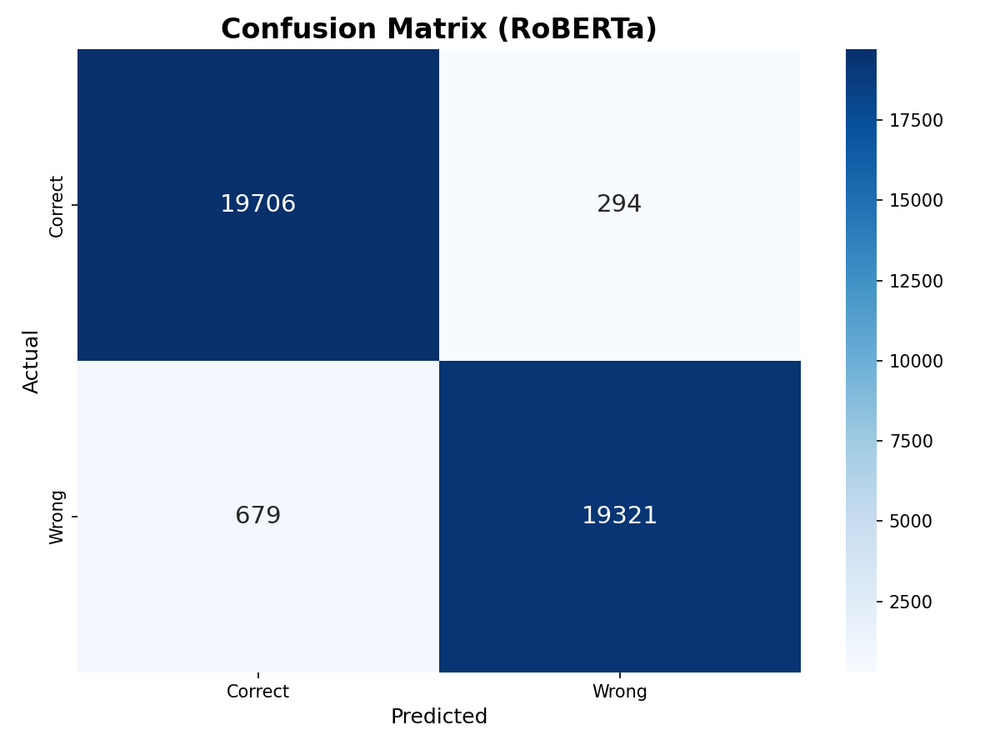
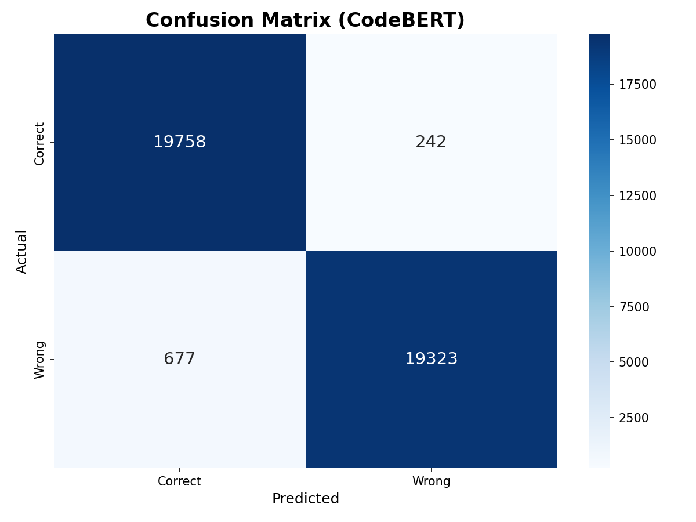
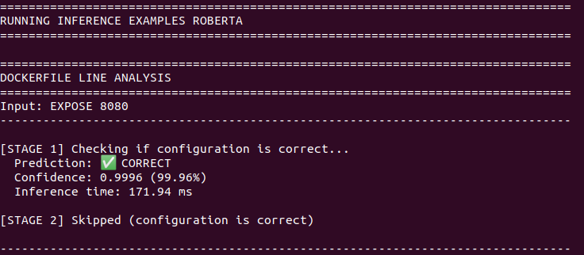
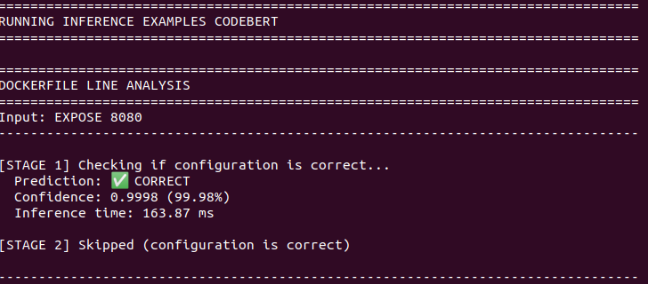
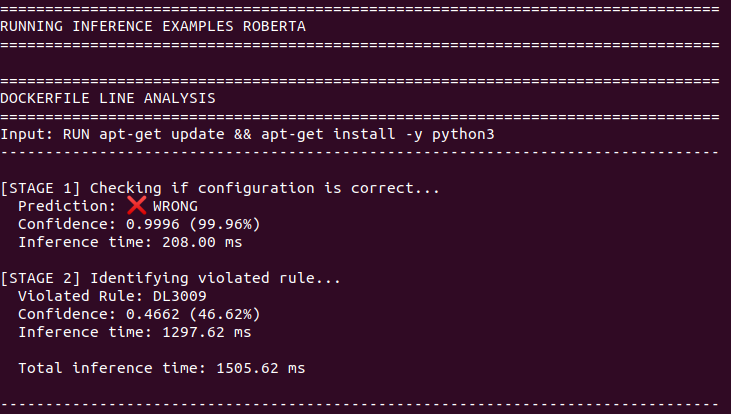
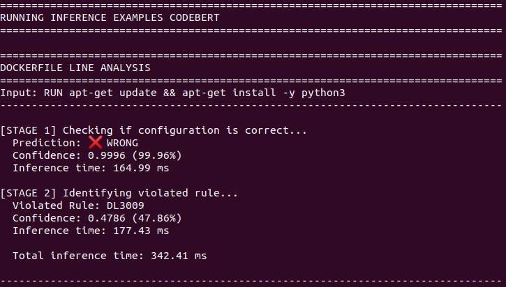

# Comparative Analysis of RoBERTa and CodeBERT for Automated Misconfiguration Detection in Dockerfiles

This repository contains the supplementary materials, presentations, and final reports for my Master's (Information Technology) Thesis research project.

## 📌 Project Overview
The goal of this research is to leverage Transformer-based models to automatically detect and classify misconfigurations in Dockerfiles. The project implements a unique **Two-Stage Detection Pipeline**:
1. **Stage 1 (Binary Classification):** Determines if an instruction is "Correct" or "Wrong".
2. **Stage 2 (Multi-class Classification):** Identifies the specific rule violation (63 categories).

## 💻 Main Code Repository
The full implementation, including data preprocessing scripts, model training, and evaluation code, can be found in the main repository:
👉 [Main Implementation Repository](https://github.com/deepakaryal/nlp-dockerlint)

## � Dataset Summary
We utilized a massive dataset of Dockerfiles to ensure model robustness.
| Aspect | Stage 1 (Binary) | Stage 2 (Rule-level) |
|--------|------------------|----------------------|
| **Initial Dataset** | ~1.6M instructions | Same dataset |
| **Classes** | 2 (Correct vs Wrong) | 63 Rules |
| **Total Samples Used** | 400,000 (Balanced) | 173,297 |
| **Training Set (80%)** | 320,000 | 138,637 |
| **Test Set (10%)** | 40,000 | 17,330 |

## 🚀 Performance Evaluation

### Stage 1: Binary Classification
Both models demonstrated exceptional ability in distinguishing between correctly and incorrectly configured instructions.
| Metric | RoBERTa | CodeBERT |
|--------|---------|----------|
| **Accuracy** | **98.0%** | **98.0%** |
| **Precision** | 0.98 | 0.98 |
| **Recall** | 0.98 | 0.98 |
| **F1-Score** | 0.98 | 0.98 |
| **AUC-ROC** | 0.9968 | **0.9970** |

### Stage 2: Rule-Specific Classification (Multi-class)
CodeBERT showed a slight edge in identifying specific semantically complex rules.
| Metric | RoBERTa | CodeBERT |
|--------|---------|----------|
| **Top-1 Accuracy** | 70.48%| **70.70%** |
| **Top-3 Accuracy** | 89.01% | **89.38%** |
| **Macro-averaged F1** | 0.7055 | **0.7136** |
| **Weighted F1** | 0.7013 | **0.7040** |

## 🖼️ Visual Results

### Confusion Matrix Comparison
The confusion matrices show the classification precision for both models in the binary stage. CodeBERT shows a slightly higher precision in correctly identifying the 'Correct' class.

| RoBERTa | CodeBERT |
|:---:|:---:|
|  |  |

### Inference Analysis (All Cases)
To demonstrate real-world performance, we provide inference examples for both 'Correct' (Stage 1 only) and 'Wrong' (Stage 1 + Stage 2 classification) scenarios.

#### ✅ Correct Instruction Detection
These examples show the models correctly identifying valid Dockerfile instructions.
| RoBERTa | CodeBERT |
|:---:|:---:|
|  |  |

#### ❌ Misconfiguration Detection & Classification
These examples show the models identifying a misconfiguration and classifying it into one of the 63 known rules.
| RoBERTa | CodeBERT |
|:---:|:---:|
|  |  |

## 📁 Repository Structure
- `reports/`: Contains the full Master's (Information Technology) Thesis report in PDF and DOCX formats.
- `presentations/`: Slide decks used for the thesis defense and viva preparation.
- `figures/`: Graphical representations of the system architecture, flowcharts, and performance plots.
- `references/`: Key academic papers and resources used throughout the research.
- `qa-session.md`: A comprehensive list of potential questions and detailed answers for viva preparation.

## 📄 Full Report
You can access the complete thesis report here:
- [Thesis Report (PDF)](./reports/thesis-nlp-dockerlint-report-20260105.pdf)
- [Final Presentation (PDF)](./presentations/thesis-nlp-dockerlint-presentation-20260109.pdf)

---
*Developed as part of a Master's (Information Technology) Thesis research project at Tribhuvan University.*
